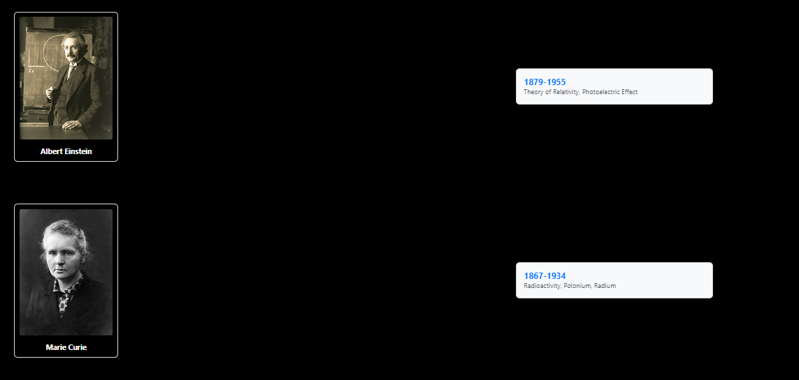
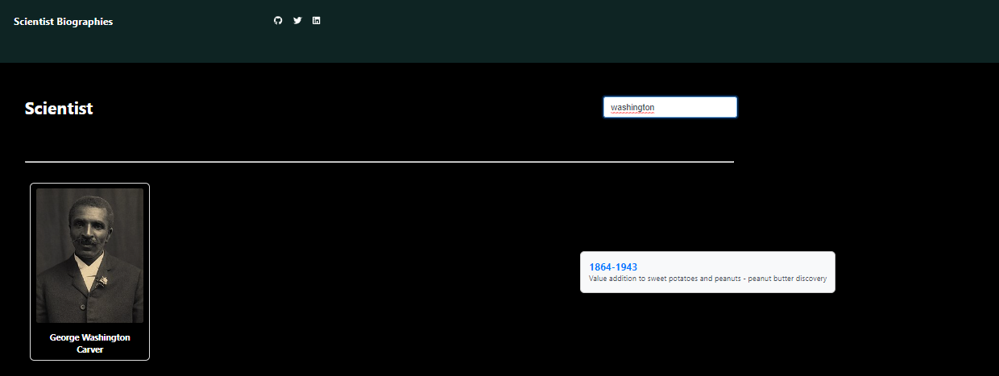

# Scientist Explorer

Scientist is a simple React project done for learning purposes. It allows users to  explore information about scientists such as their period of life, their works they are best known for. More importantly users can search for a specific scientist of interest from the huge list that is shown upfront. 

## Table of Contents

- [Installation](#installation)
- [Usage](#usage)
- [Testing](#testing)
- [License](#license)
- [Authors](#authors)
- [Demo](#demo)
- [Roadmap](#roadmap)

## Installation

Clone the repository and navigate to the project folder. Install the dependencies using:

```bash
npm install
```

## Usage

To start the development server and run the application, use:

```bash
npm start
```

Open your browser and visit [http://localhost:3000](http://localhost:3000) to view the Scientist app.


## Testing

To run tests, use the following command:

```bash
npm test
```

## License

This project is licensed under the MIT License - see the [LICENSE](LICENSE) file for details.

## Authors

- Samuel Katongole ([@shemuel2060](https://github.com/Shemuel2060))

## Demo

### social links and search input area
The top part of the app has links to my social sites and also the search area.[search-area](top.png)

### scientists listed 

A minified view of the list of scientists



### single searched scientist view



## Roadmap

### Version 1.1.0 (Upcoming Release)

- Implement user authentication for personalized scientist lists.
- Enhance the search functionality with advanced filters.
- Fetch data from an api

### Version 1.0.0 (Current Release)

- Display a list of scientists.
- Implement search functionality to find specific scientists.
